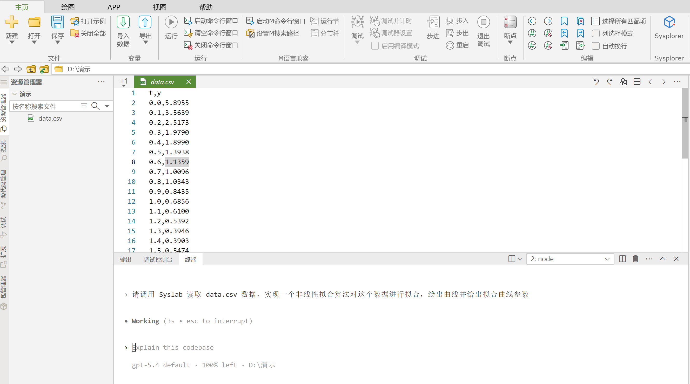
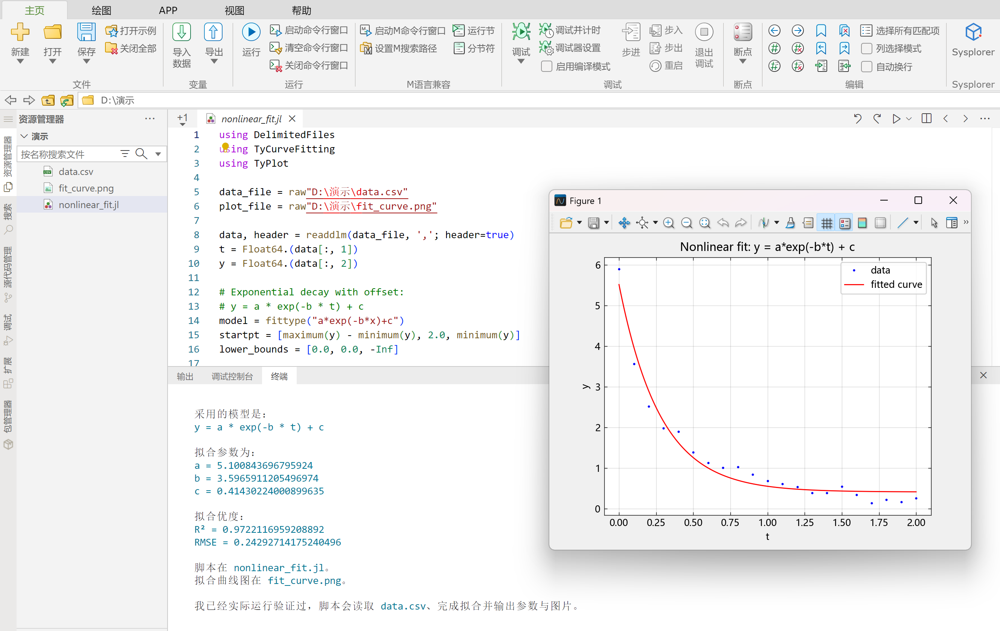
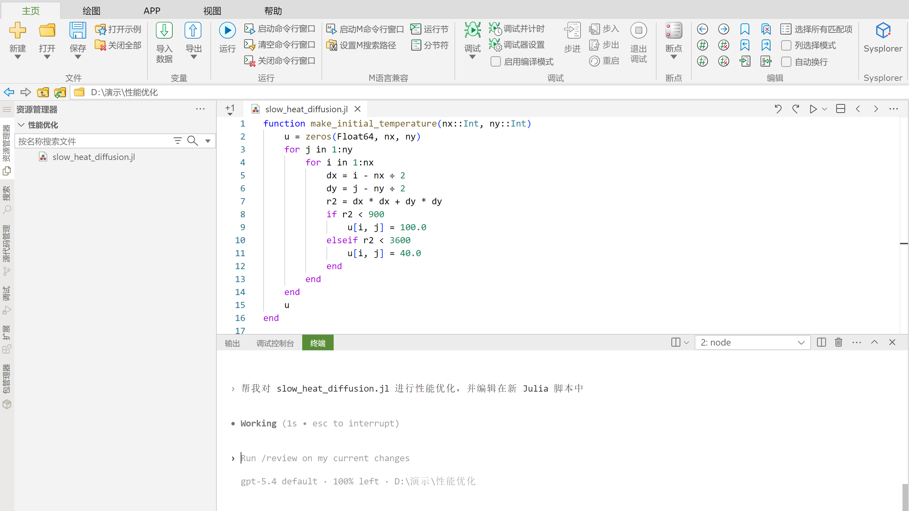
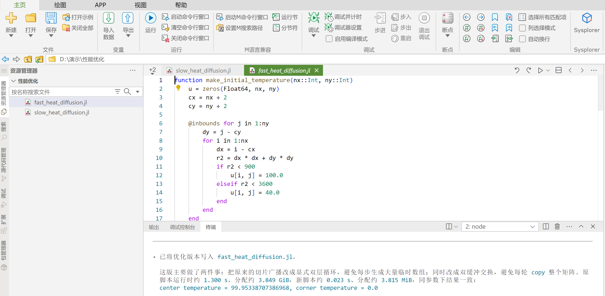
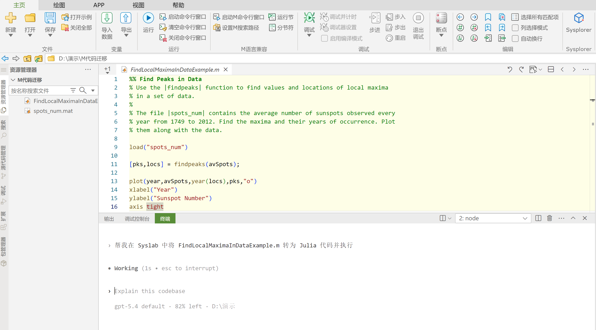
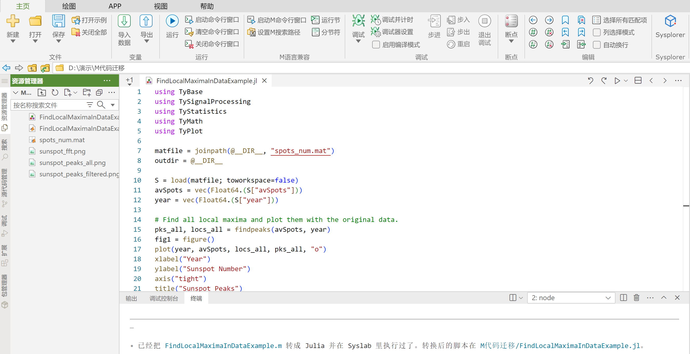
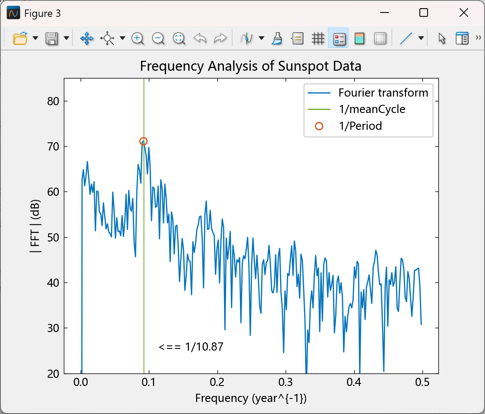

# Syslab MCP Server
---
&nbsp;

## 基本概念

Syslab MCP Server 是一个面向本地 Syslab / Julia 环境的 `stdio` MCP 服务，支持 Windows 和 Linux。

它提供的能力包括：

- 查询本机 Syslab Julia 环境和已安装的 Julia 包；
- 执行 Julia 代码；
- 执行本地 Julia 脚本；
- 重启 Julia 会话；
- 列出当前所有活跃会话及其状态；
- 搜索本机 Syslab 帮助文档；
- 读取本机帮助文档正文；
- 查询与 MATLAB 函数等价的 Syslab Julia 函数；
- 读取 Syslab skills 相关技能。

## 系统要求

- Windows 10/11 64 位；具备使用大模型能力的 Linux 系统，例如 CentOS 8、Ubuntu 20.04及以上；
- 已安装 Syslab V26.2.0 及以上版本。

## 安装方式

安装 Syslab 时会自动安装 Syslab MCP Server，默认给 Claude code、OpenCode、Codex 三类 agent 配置。

如果失败可以参考以下方式手动执行"<Syslab 安装目录>/Tools/syslab-mcp-server" 下的安装脚本。

下文以 Windows 为例：

1. 右键点击 syslab-mcp-server-install.ps1，选择「使用 PowerShell 运行」，或在当前目录启动 Powershell 后执行；

   ```powershell
   ./syslab-mcp-server-install.ps1
   ```

2. 按提示输入 Syslab 安装路径（直接回车使用默认值）；

3. 脚本会自动将 MCP 配置添加到 Claude 、OpenCode、Codex 的配置文件中；

4. 重启 Claude Code / OpenCode / Codex 客户端即可使用。

如果一键部署脚本运行失败，也可以手动配置。

### Codex:

```powershell
# 安装
codex mcp add syslab -- "<path-to>/syslab-mcp-server-win64.exe" --syslab-root="<syslab-root>" --julia-root="<julia-root>" --syslab-display-mode=desktop

# 卸载
codex mcp remove syslab
```

例如：

```powershell
# 安装
codex mcp add syslab -- "C:\Program Files\MWORKS\Syslab 2026a\Tools\syslab-mcp-server\syslab-mcp-server-win64.exe" --syslab-root="C:\Program Files\MWORKS\Syslab 2026a" --julia-root="C:\Users\Public\TongYuan\julia-1.10.10" --syslab-display-mode=desktop
```

安装后，在`~/.codex/config.toml`下可以查看配置：

```toml
[mcp_servers.syslab]
command = 'C:\Program Files\MWORKS\Syslab 2026a\Tools\syslab-mcp-server\syslab-mcp-server-win64.exe'
args = ['--syslab-root=C:\Program Files\MWORKS\Syslab 2026a', '--julia-root=C:\Users\Public\TongYuan\julia-1.10.10', '--syslab-display-mode=desktop']
```

如果使用 Codex 在 Linux 下启用 `desktop`，建议在 `~/.codex/config.toml` 中为 `syslab` MCP 配置最后手动添加：

```toml
env_vars = ["DISPLAY", "WAYLAND_DISPLAY", "XAUTHORITY", "DBUS_SESSION_BUS_ADDRESS"]
```

用于继承图形会话环境，确保图形程序能够正常启动和显示。

### Claude Desktop:

```powershell
# 安装
claude mcp add --scope user syslab -- "<path-to>/syslab-mcp-server-win64.exe" --syslab-root="<syslab-root>" --julia-root="<julia-root>" --syslab-display-mode=desktop

# 卸载
claude mcp remove syslab
```

例如：

```powershell
claude mcp add --scope user syslab -- "C:\Program Files\MWORKS\Syslab 2026a\Tools\syslab-mcp-server\syslab-mcp-server-win64.exe" --syslab-root="C:\Program Files\MWORKS\Syslab 2026a" --julia-root="C:\Users\Public\TongYuan\julia-1.10.10" --syslab-display-mode=desktop

# --scope=
# local（默认）： 仅当前项目可用
# project：团队共享（存储在.mcp.json，可提交版本库）
# user：所有项目可用（个人全局配置）
```

安装后，在 Claude 的 MCP 配置文件（如`C:\Users\TR\.claude.json `）中加入类似配置：

```json
{
    "mcpServers": {
    "syslab": {
      "type": "stdio",
      "command": "C:\\Program Files\\MWORKS\\Syslab 2026a\\Tools\\syslab-mcp-server\\syslab-mcp-server-win64.exe",
      "args": [
        "--syslab-root=C:\\Program Files\\MWORKS\\Syslab 2026a",
        "--julia-root=C:\\Users\\Public\\TongYuan\\julia-1.10.10",
        "--syslab-display-mode=desktop"
      ],
      "env": {}
    }
  },
}
```

## 启动参数

| 参数    | 说明        | 示例              |
| ---------- | ---------- | -------------- |
| `syslab-root`                  | Syslab 安装根目录。必填。| `--syslab-root="C:\Program Files\MWORKS\Syslab 2026a"`  |
| `julia-root`                   | Julia 安装根目录。选填。不传时自动查找。| `--julia-root="C:\Users\Public\TongYuan\julia-1.10.10"` |
| `initial-working-folder`       | 服务启动后的初始工作目录。不传时继承当前进程工作目录。| `--initial-working-folder="D:\workspace"`               |
| `initialize-syslab-on-startup` | 是否在 MCP `initialize` 时预启动 Syslab。默认值：`false`。| `--initialize-syslab-on-startup=true`                   |
| `pkg-offline`                  | 是否以离线包模式启动 Julia。默认值：`true`。| `--pkg-offline=true`|
| `syslab-display-mode`          | 是否启动 Syslab 桌面。`nodesktop` 不启动 Syslab 桌面；`desktop` 启动 Syslab 桌面。默认值：`desktop`。 | `--syslab-display-mode=desktop`|

## MCP Tools

1. `detect_syslab_toolboxes`

   - 返回本机 Syslab 版本信息、Julia 环境信息、Syslab Julia 环境中已安装的 Julia 包，以及可发现的本地包文档路径；
   - 输入参数：无。

2. `evaluate_julia_code`

   - 执行一段 Julia 代码并返回输出与最终结果；
   - 输入参数：
      - `code`（string）：要执行的 Julia 代码。

3. `run_julia_file`

   - 执行本地 Julia 脚本并返回输出。脚本路径必须指向有效的 `.jl` 文件；
   - 输入参数：
      - `script_path`（string）：Julia 脚本绝对路径。示例：`C:\Users\name\project\demo.jl` 或 `/home/user/project/demo.jl`。

4. `restart_julia`

   - 重启全局 Julia 会话；
   - 输入参数：无。

5. `list_sessions`

   - 列出当前所有活跃会话及其状态；
   - 输入参数：无。

6. `read_syslab_skill`

   - 读取 Syslab skill markdown 文件内容；
   - 输入参数：
      - `skill_path`（string，可选）：skill markdown 文件绝对路径。不传时默认读取 Syslab 的 skill。

7. `search_syslab_docs`

   - 搜索本地已索引的 Syslab 帮助文档；
   - 输入参数：
      - `query`（string）：搜索关键词；
      - `package`（string，可选）：限定搜索的包名；
      - `max_results`（number，可选）：返回结果条数上限。

8. `read_syslab_doc`

   - 读取一篇已索引的 Syslab 帮助文档的正文内容；
   - 输入参数：
      - `doc_path`（string）：文档路径，通常直接使用 `search_syslab_docs` 返回结果中的 `path` 字段。

9. `map_matlab_functions_to_julia`
   - 将一组 MATLAB 函数名映射到 Syslab Julia 环境中的候选等价函数及相关文档，适用于 MATLAB 代码迁移和函数替换场景；
   - 输入参数：
      - `symbols`（string[]）：MATLAB 函数名列表；
      - `max_results_per_symbol`（number，可选）：每个 MATLAB 函数最多返回的候选数量。

## 示例 1：算法开发

下面的示例展示如何通过 Syslab MCP Server 实现一个 Julia 算法脚本，对实验数据进行非线性函数拟合。

可以参考输入的提示词为：“请调用 Syslab 读取 <a :href="$withBase('/SyslabAI/SyslabMCPServer/data.csv')" target="_blank"  download="data.csv">data.csv</a> 数据，实现一个非线性拟合算法对这个数据进行拟合，绘出曲线并给出拟合曲线参数”。



最终可以得到的拟合曲线和参数如下：



## 示例 2：性能优化

下面的示例展示如何优化代码性能。

二维热扩散模拟优化前的代码：

```julia
function make_initial_temperature(nx::Int, ny::Int)
    u = zeros(Float64, nx, ny)
    for j in 1:ny
        for i in 1:nx
            dx = i - nx ÷ 2
            dy = j - ny ÷ 2
            r2 = dx * dx + dy * dy
            if r2 < 900
                u[i, j] = 100.0
            elseif r2 < 3600
                u[i, j] = 40.0
            end
        end
    end
    u
end

function diffuse_slow(u0::Matrix{Float64}, alpha::Float64, steps::Int)
    u = copy(u0)
    for _ in 1:steps
        next = copy(u)
        next[2:end-1, 2:end-1] =
            u[2:end-1, 2:end-1] .+
            alpha .* (
                u[1:end-2, 2:end-1] .+
                u[3:end, 2:end-1] .+
                u[2:end-1, 1:end-2] .+
                u[2:end-1, 3:end] .-
                4.0 .* u[2:end-1, 2:end-1]
            )
        u = next
    end
    u
end

u0 = make_initial_temperature(500, 500)
@time u = diffuse_slow(u0, 0.12, 260)
println("center temperature = ", u[250, 250], ", corner temperature = ", u[1, 1])
```

```dataframe
  1.768073 seconds (4.26 k allocations: 3.849 GiB, 28.94% gc time, 0.35% compilation time)
center temperature = 99.95338707386968, corner temperature = 0.0
```

可以参考输入的提示词为：“帮我对 <a :href="$withBase('/SyslabAI/SyslabMCPServer/slow_heat_diffusion.jl')" target="_blank"  download="slow_heat_diffusion.jl">slow_heat_diffusion.jl</a> 进行性能优化，并编辑在新 Julia 脚本中”。



优化后生成的代码示例：



实际运行后的结果为：

```dataframe
  0.025668 seconds (4 allocations: 3.815 MiB)
center temperature = 99.95338707386968, corner temperature = 0.0
```

计算结果与优化前一致，代码性能提升明显。

## 示例 3：M 代码迁移

下面的示例展示如何将 M 代码迁移为可执行的 Julia 代码。

可以参考输入的提示词为：“帮我在 Syslab 中将 <a :href="$withBase('/SyslabAI/SyslabMCPServer/FindLocalMaximaInDataExample.zip')" target="_blank"  download="FindLocalMaximaInDataExample.zip">FindLocalMaximaInDataExample.m</a> 转为 Julia 代码并执行”。

M 代码示例：



进行转换后的 Julia 代码示例：



文件 spots_num 包含了从 1749 年到 2012 年每年观测到的太阳黑子的平均数量。

太阳黑子周期为 11 年，代码中使用了傅里叶变换进行验证，下面为验证结果图和参数：



以下参数分别为平均周期和主峰频率换算成的周期。

```dataframe
meanCycle = 10.869565217391305
Period = 10.893617021276595
```
